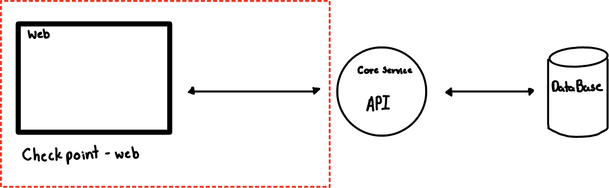
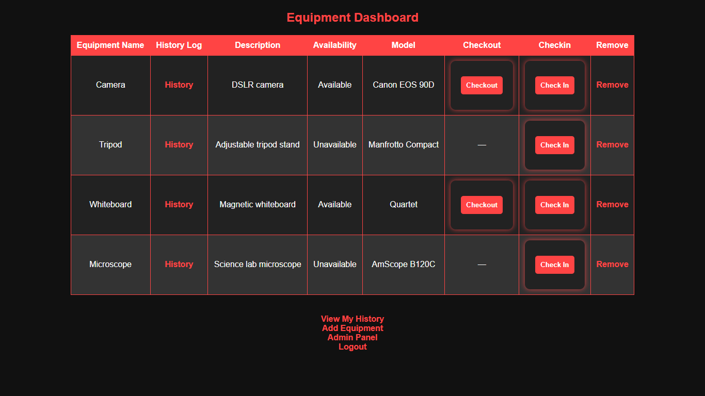
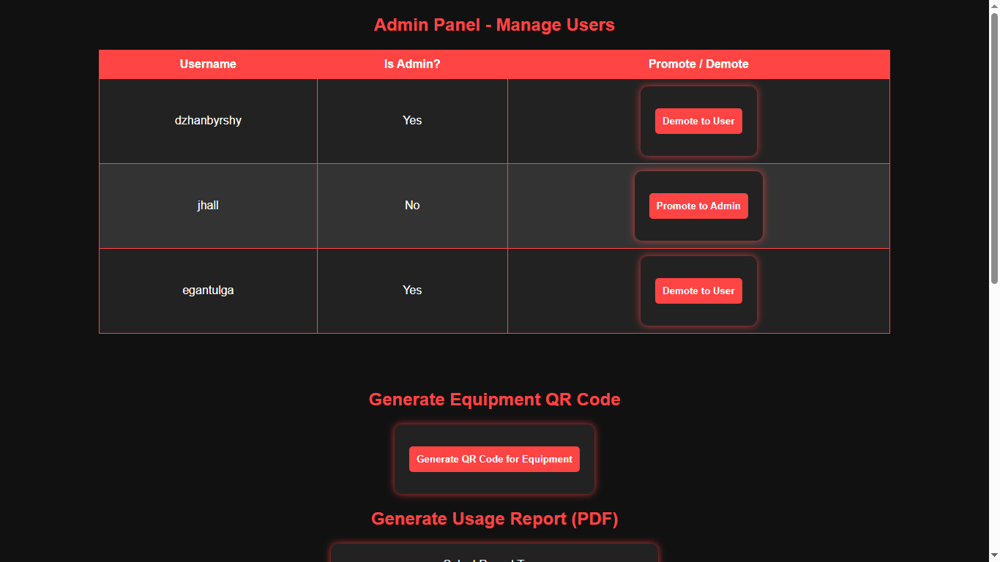
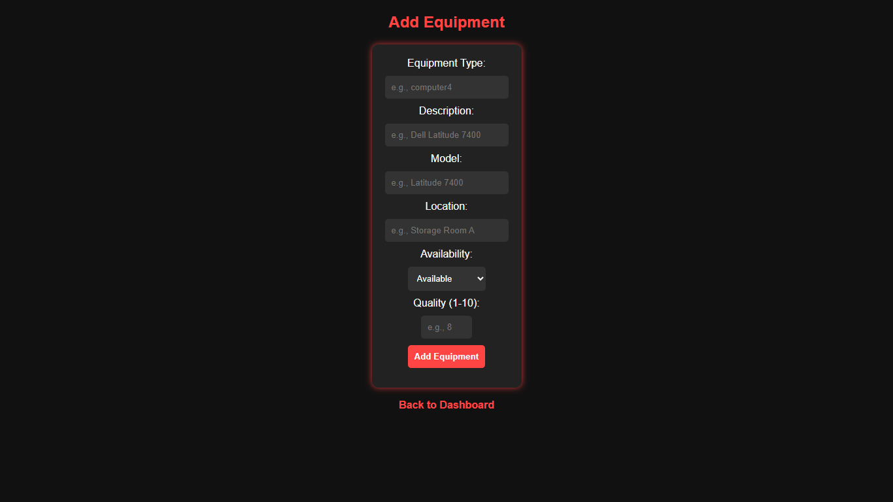

# checkpoint-web

## Project Description 

### Overview
CheckPoint is a software that will be used to manage the sharing of the computer science
department resources. This will provide a way for students to check out equipment for use of
technology. Through the software a user will be able to maintain their personal usage history
and future equipment use. This software will be a way the computer science department can
allow equipment to be used by ambitious students while holding them accountable for the
equipment they borrow.

There will be two types of users: regular users and admins. Regular users can check out and
check in equipment from a list of available technologies. This list will be monitored by admin
users who will have access to add and remove equipment from this list. Regular users will also
see their personal borrow history and current borrowed equipment. The Admin users will have
full control over the availability of the equipment, management of other users, and the ability to
send notifications to users borrowing equipment currently. Admin users can also generate
reports that show current and past equipment usage, and reserve equipment for future
classroom use. The Admin users will have these controls in addition to the regular user access.

### Major Features
- Check-In/Check-Out Equipment: Regular users can borrow and return equipment.
- See Personal Borrowing History: Regular users can view their personal history of
borrowed equipment, including check-in/check-out dates, and due dates.
- List Department Equipment: Regular users can view a list of all department equipment
including item status, availability dates, and other item details.
- Manage Equipment: Admins can add and remove departmental equipment from the
system.
- Manage User Permissions: Admins can toggle user roles (regular vs. admin
permissions).
- Automated Reminders and Notifications: The system should send automated reminders
when due dates approach. Past-due notifications should be sent to both users and
admins. Admins should also be alerted when equipment is checked-in and checked-out.
- Generate Usage Reports: Admins can generate detailed reports showing the statuses of
all equipment, the users that currently have equipment out on loan, and return dates.
Equipment Status Verification on Return: Following equipment return, admins should
have the ability to assert that they have checked the equipment and that the most recent
user returned the equipment in good condition. If the item was returned damaged, then
admins can enter additional information describing the damage.

### System Diagram


### Screenshots




## Project Dependencies (Software and Infrastructure)

### Dependencies 
- flask - lightweight web framework used to handle routing, sessions, templates, and HTTP requests.
- qrcode - used to generate QR codes dynamically.
- reportlab - used to generate PDF files containing user-specific data.
- requests - used to make HTTP requests to external services and APIs.
- Python standard library - uuid, datetime, timedelta, secrets, io – for unique IDs, date handling, secure tokens, and in-memory file management.

### Runtime Environments
- Python 3.x
- Flask development server – used for local testing and running the app.
- Docker Desktop – for container orchestration.
- Docker Compose – builds and runs containers for the server and PostgreSQL database.

### Backend products and services
- PostgreSQL – used as the relational database to store user and equipment data.
- FastAPI – the backend framework used to create RESTful endpoints for user and equipment management.
- Swagger UI – automatically generated API documentation provided by FastAPI, useful for exploring and testing available endpoints during development.

## Quick Start Guide

### Installation and Run Instructions
Important: Make sure the Checkpoint Core backend is up and running before launching this application. The frontend depends on it to handle user authentication, equipment data, and reservations. 

1. Clone this repository
```bash
git clone git@github.com:Rhodes-CS-comp486/checkpoint-web.git
cd .\checkpoint-web\
```
2. (Optional but recommended) Create and activate a virtual environment
```bash
python -m venv venv
# On macOS/Linux:
source venv/bin/activate
# On Windows:
venv\Scripts\activate
```
3. Install required Python dependencies
```bash
pip install flask qrcode reportlab requests
```
4. Navigate to the project’s website directory
```bash
cd .\website\
```
5. Run the application
```bash
python .\app.py
```
6. Use the application
- After launching, the Flask development server will display a link like: ```http://127.0.0.1:5000```
- Click the link or paste it into your browser to access the site.

---

The counterpart project to Checkpoint-Core is the web app, Checkpoint-Web. You can access the repository for Checkpoint-Web at https://github.com/Rhodes-CS-comp486/checkpoint-core